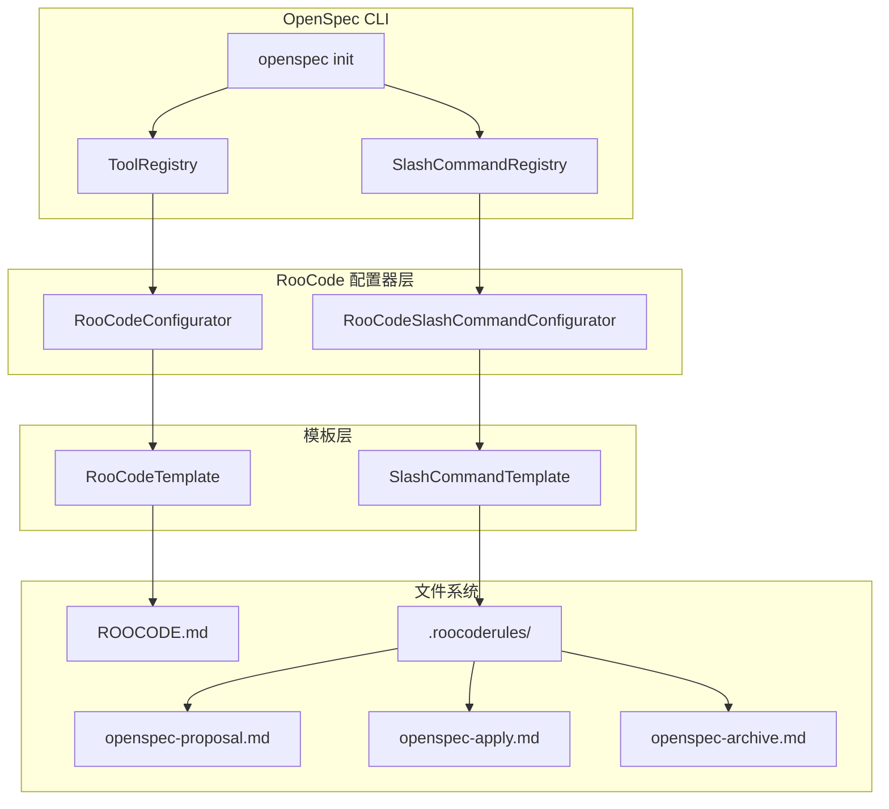
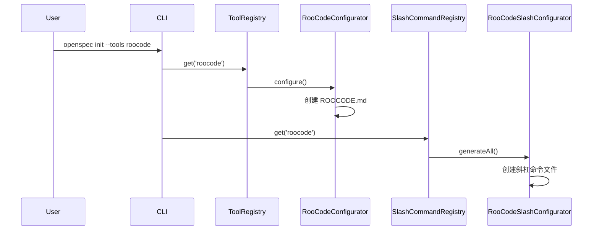

# RooCode 插件技术设计文档

## 1. 架构概述

### 1.1 架构目标

* 可扩展性: 支持未来 RooCode 功能扩展和新特性添加
* 兼容性: 与现有 Cline 实现保持兼容，同时体现 RooCode 差异化
* 可维护性: 遵循 OpenSpec 现有架构模式，便于维护和更新

### 1.2 架构原则

* 单一职责原则: 每个配置器专注于特定功能
* 开闭原则: 对扩展开放，对修改封闭
* 里氏替换原则: RooCode 配置器可替换 Cline 配置器
* 接口隔离原则: 明确定义配置器接口
* 依赖倒置原则: 依赖抽象而非具体实现

## 2. 系统架构

### 2.1 整体架构图



### 2.2 架构分层

#### 2.2.1 配置器层

* RooCodeConfigurator: 负责 ROOCODE.md 根配置文件生成
* RooCodeSlashCommandConfigurator: 负责斜杠命令文件生成

#### 2.2.2 模板层

* RooCodeTemplate: 提供 RooCode 特定模板内容
* SlashCommandTemplate: 提供通用斜杠命令模板

#### 2.2.3 注册层

* ToolRegistry: 管理工具配置器注册
* SlashCommandRegistry: 管理斜杠命令配置器注册

## 3. 服务设计

### 3.1 核心组件

| 组件名称 | 职责 | 技术栈 | 依赖 |
|----------|------|--------|------|
| RooCodeConfigurator | 管理 ROOCODE.md 配置文件 | TypeScript | ToolConfigurator 接口 |
| RooCodeSlashCommandConfigurator | 管理 .roocoderules/ 目录 | TypeScript | SlashCommandConfigurator 基类 |
| RooCodeTemplate | 提供 RooCode 模板内容 | TypeScript | TemplateManager |

### 3.2 组件交互

#### 3.2.1 初始化流程



#### 3.2.2 文件生成流程

1. 用户执行初始化命令
2. 系统查找 RooCode 配置器
3. 生成根配置文件 ROOCODE.md
4. 生成斜杠命令文件
5. 注册到系统注册表

### 3.3 API设计

#### 3.3.1 RooCodeConfigurator

* **接口**: ToolConfigurator
* **方法**: configure(projectPath: string, openspecDir: string): Promise<void>
* **配置文件**: ROOCODE.md

#### 3.3.2 RooCodeSlashCommandConfigurator

* **接口**: SlashCommandConfigurator
* **方法**: generateAll(projectPath: string, openspecDir: string): Promise<string[]>
* **文件路径**: 
  - `.roocoderules/openspec-proposal.md`
  - `.roocoderules/openspec-apply.md`
  - `.roocoderules/openspec-archive.md`

## 4. 数据架构

### 4.1 文件结构策略

* 根配置文件: ROOCODE.md (项目根目录)
* 斜杠命令目录: .roocoderules/ (项目根目录)
* 模板文件: 集成在 TemplateManager 中

### 4.2 数据一致性

* 使用 OpenSpec 标记管理内容更新
* 遵循现有文件更新机制
* 保持与 Cline 实现的一致性

## 5. 实现细节

### 5.1 文件结构设计

```
项目根目录/
├── ROOCODE.md                    # RooCode 根配置文件
├── .roocoderules/                 # RooCode 规则目录
│   ├── openspec-proposal.md      # 提案工作流
│   ├── openspec-apply.md         # 实现工作流
│   └── openspec-archive.md       # 归档工作流
└── openspec/                     # OpenSpec 目录
    ├── changes/
    ├── specs/
    └── ...
```

### 5.2 模板内容设计

#### 5.2.1 ROOCODE.md 模板

```markdown
# RooCode Instructions

These instructions are for RooCode AI assistant working in this project.

Always open `@/openspec/AGENTS.md` when the request:
- Mentions planning or proposals (words like proposal, spec, change, plan)
- Introduces new capabilities, breaking changes, architecture shifts, or big performance/security work
- Sounds ambiguous and you need the authoritative spec before coding

Use `@/openspec/AGENTS.md` to learn:
- How to create and apply change proposals
- Spec format and conventions
- Project structure and guidelines

Keep this managed block so 'openspec update' can refresh the instructions.
```

#### 5.2.2 斜杠命令模板

基于现有 slash-command-templates.ts，使用相同的模板内容，但适配 RooCode 的文件路径格式。

### 5.3 注册机制设计

#### 5.3.1 工具注册表集成

在 `src/core/config.ts` 的 AI_TOOLS 数组中添加：
```typescript
{ name: 'RooCode', value: 'roocode', available: true, successLabel: 'RooCode' }
```

#### 5.3.2 配置器注册

在 `src/core/configurators/registry.ts` 中注册：
```typescript
import { RooCodeConfigurator } from './roocode.js';

// 在静态初始化块中添加
const roocodeConfigurator = new RooCodeConfigurator();
this.tools.set('roocode', roocodeConfigurator);
```

#### 5.3.3 斜杠命令注册

在 `src/core/configurators/slash/registry.ts` 中注册：
```typescript
import { RooCodeSlashCommandConfigurator } from './roocode.js';

// 在静态初始化块中添加
const roocode = new RooCodeSlashCommandConfigurator();
this.configurators.set(roocode.toolId, roocode);
```

## 6. 技术选型

### 6.1 核心技术

* **语言**: TypeScript (与项目保持一致)
* **框架**: 无额外框架依赖
* **文件系统**: 使用现有的 FileSystemUtils

### 6.2 设计模式

* **策略模式**: 配置器实现不同的配置策略
* **工厂模式**: 模板管理器创建不同类型模板
* **注册表模式**: 统一管理配置器实例

## 7. 兼容性设计

### 7.1 与 Cline 的兼容性

* 使用相同的接口定义
* 复用相同的模板内容
* 遵循相同的文件更新机制
* 保持相同的注册流程

### 7.2 差异化设计

* 不同的文件路径 (.roocoderules/ vs .clinerules/)
* 不同的根配置文件名 (ROOCODE.md vs CLINE.md)
* 不同的工具标识符 ('roocode' vs 'cline')

## 8. 扩展性考虑

### 8.1 未来扩展点

* 支持自定义 RooCode 特定功能
* 支持 RooCode 独有的配置选项
* 支持与 RooCode 生态系统的深度集成

### 8.2 维护策略

* 遵循现有代码风格和约定
* 保持与主线代码的同步更新
- 定期评估和优化实现